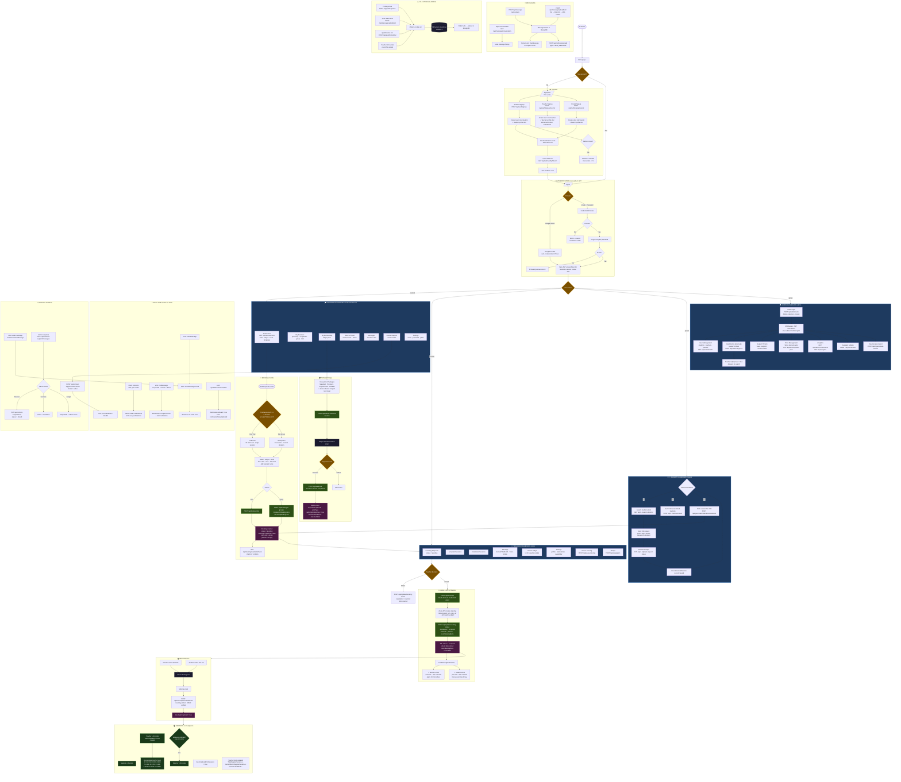

# eTutor4Me — Complete System Flowchart

```mermaid
flowchart TD

%% ─────────────────────────────────────────────
%%  ENTRY
%% ─────────────────────────────────────────────
    VISITOR([🌐 Visitor]) --> HOME[Homepage /]
    HOME --> HAS_ACCT{Has account?}
    HAS_ACCT -- No --> SIGNUP_AS[/SignupAs\nPick a role/]
    HAS_ACCT -- Yes --> LOGIN_PAGE[/signin/]

%% ─────────────────────────────────────────────
%%  SIGNUP FLOWS
%% ─────────────────────────────────────────────
    subgraph SIGNUP ["✍️  SIGNUP"]
        direction TB
        SIGNUP_AS --> SS[Student Signup\nPOST /api/auth/signup]
        SIGNUP_AS --> TS[Teacher Signup\nPOST /api/auth/signup/teacher]
        SIGNUP_AS --> PS[Parent Signup\nPOST /api/auth/signup/parent]

        SS --> SS1[Create User role=student\n+ Student profile doc]
        TS --> TS1[Create User role=teacher\n+ Teacher profile doc\nEmail verification DISABLED]
        PS --> PS1[Create User role=parent\n+ Parent profile doc]

        SS1 --> VER_EMAIL[Send verification email\nJWT token link]
        PS1 --> VER_EMAIL
        VER_EMAIL --> VER_CLICK[User clicks link\nGET /api/auth/verify?token=]
        VER_CLICK --> VERIFIED[user.verified = true]

        SS1 --> REF_CHECK{Referral code?}
        REF_CHECK -- Yes --> REF_REWARD[Referrer +5 etokis\nUser.etokis += 5]
    end

%% ─────────────────────────────────────────────
%%  LOGIN & SESSION
%% ─────────────────────────────────────────────
    subgraph AUTH ["🔐  AUTHENTICATION  next-auth v4 JWT"]
        direction TB
        LOGIN_PAGE --> PROVIDER{Provider}
        PROVIDER -- Google OAuth --> G_LOGIN[GoogleProvider\nauto-create student if new]
        PROVIDER -- Email + Password --> C_LOGIN[CredentialsProvider]
        C_LOGIN --> UNVERIFIED{verified?}
        UNVERIFIED -- No --> BLOCK[Block + resend\nverification email]
        UNVERIFIED -- Yes --> PWD_CHECK[bcrypt.compare password]
        PWD_CHECK --> PWD_MATCH{Match?}
        PWD_MATCH -- No --> WRONG_PWD[❌ Invalid password error]
        PWD_MATCH -- Yes --> JWT_ISSUE[Sign JWT accessToken 1h\nNextAuth session cookie 30d]
        G_LOGIN --> JWT_ISSUE
    end

    VERIFIED --> LOGIN_PAGE
    JWT_ISSUE --> ROLE_GATE{role in token}

%% ─────────────────────────────────────────────
%%  ROLE ROUTING
%% ─────────────────────────────────────────────
    ROLE_GATE -- student --> SDASH
    ROLE_GATE -- teacher --> TDASH
    ROLE_GATE -- parent  --> PDASH
    ROLE_GATE -- admin   --> ADASH

%% ─────────────────────────────────────────────
%%  STUDENT DASHBOARD
%% ─────────────────────────────────────────────
    subgraph SDASH ["🎓  STUDENT DASHBOARD  /studentdashboard"]
        direction TB
        S_FIND[Find ETutor\nGET /api/fetchteachers\nFilter: subject · level · language]
        S_SESS[My Sessions\nupcoming · completed · group · trial]
        S_MEM[My Membership\nStripe plans]
        S_REFER[Refer a Friend\nreferral code + etokis]
        S_MSG[Messages\nreal-time chat]
        S_SUPP[Contact Support\nraise a ticket]
        S_SET[Settings\nemail · password · photo]
    end

    S_FIND --> BOOK_ENTRY

%% ─────────────────────────────────────────────
%%  BOOKING FLOW
%% ─────────────────────────────────────────────
    subgraph BOOKING ["📅  BOOKING FLOW"]
        direction TB
        BOOK_ENTRY([Student picks a tutor]) --> TRIAL_CHECK{TrialSessionLeft > 0\n& teacher acceptsTrialSession?}

        TRIAL_CHECK -- Yes: Trial --> TRIAL_FORM[Trial form\n30 min fixed · single session]
        TRIAL_CHECK -- No: Group  --> GROUP_FORM[Group form\nN sessions · custom duration]

        TRIAL_FORM --> FORM_FIELDS[Select: subject · level\nPick: date · time · timezone\nAdd: student notes]
        GROUP_FORM --> FORM_FIELDS

        FORM_FIELDS --> SUBMIT_BOOK{Submit}
        SUBMIT_BOOK -- trial --> API_TRIAL[POST /api/booking/trial]
        SUBMIT_BOOK -- group --> API_GROUP[POST /api/booking/in-groups\nCreates N Booking docs\n+ 1 GroupBooking doc]

        API_TRIAL --> BOOKING_DOC[Booking created\nstatus = pending\nmeetingCompleted = false\nstartLink = empty\njoinLink = empty]
        API_GROUP --> BOOKING_DOC

        BOOKING_DOC --> AVAIL_CHECK[GET /api/booking/AvailableCheck\ncheck for conflicts]
    end

%% ─────────────────────────────────────────────
%%  TEACHER DASHBOARD
%% ─────────────────────────────────────────────
    subgraph TDASH ["👨‍🏫  TEACHER DASHBOARD  /etutor"]
        direction TB
        T_REQUESTS[Incoming Requests\nstatus = pending]
        T_ACCEPTED[Accepted Sessions]
        T_COMPLETED[Completed Sessions]
        T_EARN[Earnings\nEarnedThisMonth · Total · Etokis]
        T_LEVEL[Level & Badge\n1–10 based on etokis]
        T_SET[Settings\nprofile · bank details · availability]
        T_PAUSE[Pause Tutoring\nPOST /api/pause-tutoring]
        T_RESIGN[Resign\nPOST /api/resignation]
    end

    BOOKING_DOC --> T_REQUESTS

    T_REQUESTS --> TCH_DECISION{Teacher decision}
    TCH_DECISION -- Reject --> REJECT_BOOK[POST /api/update-booking-status\nnewStatus = rejected\nlinks cleared]
    TCH_DECISION -- Accept --> ZOOM_FLOW

%% ─────────────────────────────────────────────
%%  ZOOM + ACCEPTANCE
%% ─────────────────────────────────────────────
    subgraph ZOOM_FLOW ["🎥  ZOOM + ACCEPTANCE"]
        direction TB
        ZOOM_API[POST /api/zoomapi\nOAuth Account Credentials grant]
        ZOOM_API --> ZOOM_MTG[Zoom API creates meeting\nReturns start_url + join_url\n+ full meeting object]
        ZOOM_MTG --> ACCEPT_API[POST /api/update-booking-status\nnewStatus = accepted\nstartLink · joinLink · zoomMeetingData]
        ACCEPT_API --> DB_ACCEPT[DB: status = accepted\nZoom links stored\nzoomMeetingData embedded]
        DB_ACCEPT --> SEND_EMAILS[sendBookingNotifications]
        SEND_EMAILS --> TCH_EMAIL[📧 Teacher email\nstartLink + ICS calendar\nalarm 10 min before]
        SEND_EMAILS --> STU_EMAIL[📧 Student email\njoinLink + ICS calendar\nfirst-session tips if new]
    end

%% ─────────────────────────────────────────────
%%  SESSION DAY
%% ─────────────────────────────────────────────
    DB_ACCEPT --> SESSION_DAY

    subgraph SESSION_DAY ["🟢  SESSION DAY"]
        direction LR
        TCH_CLICK[Teacher clicks Start link] --> ZOOM_LIVE[Zoom Meeting Live]
        STU_CLICK[Student clicks Join link]  --> ZOOM_LIVE
        ZOOM_LIVE --> ZOOM_END[Meeting ends]
        ZOOM_END --> ZOOM_HOOK[POST /api/zoomapi/zoomwebhook\nmeeting.ended · HMAC verified]
        ZOOM_HOOK --> MARK_DONE[meetingCompleted = true]
    end

    MARK_DONE --> REWARDS

%% ─────────────────────────────────────────────
%%  REWARDS
%% ─────────────────────────────────────────────
    subgraph REWARDS ["🏆  REWARDS on Completion"]
        direction TB
        STU_ETOK[Student +10 etokis]
        TCH_ETOK[Teacher +40 etokis\nTeacherEtokies record created]
        TCH_ETOK --> LEVEL_CALC[Recalculate teacher level\n1=0 2=150 3=300 4=800\n5=1200 6=1700 7=2400\n8=3500 9=4500 10=5500+]
        FIRST_SESS[hasCompletedFirstSession = true]
        REF_BONUS{Was user referred?\none-time only}
        REF_BONUS -- Yes --> REFERRER_BONUS[Referrer +50 etokis]
        TCH_STATS[Teacher stats updated\nTotalRegularSession++\ncurrentMonthRegularSession++\nsessionsPerMonth--]
    end

%% ─────────────────────────────────────────────
%%  PARENT DASHBOARD
%% ─────────────────────────────────────────────
    subgraph PDASH ["👨‍👩‍👧  PARENT DASHBOARD  /parent"]
        direction TB
        P_LINK{Linked to student?}
        P_LINK -- No --> P_SEARCH_STU[Search student email\nGET /api/.../search-students]
        P_SEARCH_STU --> P_SEND_REQ[Send link request\nPOST /api/.../Send-Request-to-Student]
        P_SEND_REQ --> STU_ACCEPT_LINK[Student accepts\nPUT /api/.../Update-request-status]
        STU_ACCEPT_LINK --> RELATION[ParentStudentRelation record created]
        RELATION --> P_LINK
        P_LINK -- Yes --> P_SWITCH[Switch between linked students\nPOST /api/.../switchAccount]
        P_LINK -- Yes --> P_BOOK[Book session for child\nPOST /api/parentdashboard/bookasession]
        P_BOOK --> BOOKING_DOC
    end

%% ─────────────────────────────────────────────
%%  ADMIN DASHBOARD
%% ─────────────────────────────────────────────
    subgraph ADASH ["🛡️  ADMIN DASHBOARD  /admin"]
        direction TB
        A_AUTH[Admin login\nPOST /api/admin/auth\nAdmin collection + bcrypt]
        A_AUTH --> A_GATE[Middleware: JWT role=admin\nelse redirect /admin/signin]
        A_GATE --> A_USERS[User Management\nstudents · teachers · parents\nGET /api/admin/fetch-*]
        A_GATE --> A_QUAL[Qualification Approvals\nreview S3 docs\nPOST /api/admin/approve]
        A_GATE --> A_TICKETS[Support Tickets\nview · respond · close/escalate]
        A_GATE --> A_PRICE[Price Management\nStripe plan amounts\nPUT /api/admin/update-price]
        A_GATE --> A_ANALYTICS[Analytics\nGET /api/admin/Totalincome\nGET /api/analytics]
        A_GATE --> A_ASSIST[Assistant Admins\ncreate · set permissions]
        A_GATE --> A_IMPERSONATE[Impersonate student\nPOST /api/impersonate-student]
        A_QUAL --> QUAL_APPROVED[Teacher.isApproved = true\nAppears in search]
    end

%% ─────────────────────────────────────────────
%%  REAL-TIME SYSTEM
%% ─────────────────────────────────────────────
    subgraph REALTIME ["⚡  REAL-TIME  Socket.IO :5000"]
        direction TB
        SOCK_CONNECT[Client connects\nemit: join userId]
        SOCK_CONNECT --> LOAD_NOTIFS[Server loads notifications\nemit: user_notifications]
        CHAT_MSG[emit: chatMessage\nrecipientId · content · fileUrl]
        CHAT_MSG --> SOCK_BROADCAST[Broadcast to recipient room\n+ emit: notification]
        TICK_JOIN[emit: joinTicketRoom ticketId]
        TICK_MSG[emit: ticketMessage]
        TICK_MSG --> SAVE_TICK[Save TicketMessage to DB]
        SAVE_TICK --> TICK_BROADCAST[Broadcast to ticket room]
        READ_NOTIF[emit: updateNotificationStatus]
        READ_NOTIF --> MARK_READ[Notification.isRead = true\nemit: notificationStatusUpdated]
    end

%% ─────────────────────────────────────────────
%%  MESSAGING
%% ─────────────────────────────────────────────
    subgraph MESSAGING ["💬  MESSAGING"]
        direction TB
        MSG_OPEN[Open conversation\nGET /api/message/conversation]
        MSG_OPEN --> MSG_HISTORY[Load message history]
        MSG_TEXT[POST /api/message\ntext content]
        MSG_FILE[POST /api/message/uploadtos3\nfile → AWS S3 → URL stored]
        MSG_TEXT --> MSG_STORED[Message saved to MongoDB]
        MSG_FILE --> MSG_STORED
        MSG_STORED --> SOCK_MSG[Socket: emit chatMessage\nto recipient room]
        MSG_STORED --> NOTIF_API[POST /api/notifications/add\ntype = NEW_MESSAGE]
    end

%% ─────────────────────────────────────────────
%%  PAYMENT
%% ─────────────────────────────────────────────
    subgraph PAYMENT ["💳  PAYMENT  Stripe"]
        direction TB
        VIEW_PLANS[View plans /Packages\nStandard · Premium · PayAsYouGo · Bundles\n× Junior / Senior / Expert tutor level]
        VIEW_PLANS --> CHECKOUT_SES[POST /api/create-checkout-session]
        CHECKOUT_SES --> STRIPE_PAGE[Stripe Checkout hosted page]
        STRIPE_PAGE --> PAY_RESULT{Payment result}
        PAY_RESULT -- Success --> STR_HOOK[POST /api/webhook\ncheckout.session.completed]
        STR_HOOK --> UPDATE_SUB[Update User:\nstripeSubscriptionId · planType\nsubscriptionIsActive = true\nsessionsPerMonth · dateStart/End]
        PAY_RESULT -- Failure --> PAY_FAIL[Show error]
    end

    S_MEM --> VIEW_PLANS

%% ─────────────────────────────────────────────
%%  FILE STORAGE
%% ─────────────────────────────────────────────
    subgraph S3 ["☁️  FILE STORAGE  AWS S3"]
        direction LR
        S3_PIC[Profile picture\nPOST /api/profile-picture]
        S3_CHAT[Chat attachment\nPOST /api/message/uploadtos3]
        S3_QUAL[Qualification doc\nPOST /api/qualificationDoc]
        S3_VID[Teacher intro video\nvia profile update]
        S3_PIC & S3_CHAT & S3_QUAL & S3_VID --> MULTER[Multer + multer-s3]
        MULTER --> S3_BUCKET[(S3 bucket: etutor4me\nus-east-1)]
        S3_BUCKET --> S3_URL[Public URL → stored in MongoDB]
    end

%% ─────────────────────────────────────────────
%%  SUPPORT TICKET
%% ─────────────────────────────────────────────
    subgraph SUPPORT ["🎫  SUPPORT TICKETS"]
        direction TB
        CREATE_TICKET[POST /api/contact-support/create-ticket\nstatus = active]
        CREATE_TICKET --> TICK_JOIN
        USER_REPLY[User sends message\nvia Socket ticketMessage]
        USER_REPLY --> SAVE_TICK
        ADMIN_REPLY[Admin responds\nPOST /api/contact-support/messages]
        ADMIN_REPLY --> TICK_STATUS{Admin action}
        TICK_STATUS -- Resolve --> CLOSE_TICK[PUT /api/contact-support/close\nstatus = closed]
        TICK_STATUS -- Escalate --> ESC_TICK[status = escalated]
        TICK_STATUS -- Assign --> ASSIGN_TICK[assignedTo = admin name]
    end

    S_SUPP --> CREATE_TICKET

%% ─────────────────────────────────────────────
%%  STYLES
%% ─────────────────────────────────────────────
    classDef dashboard  fill:#1e3a5f,color:#fff,stroke:#4a90d9,stroke-width:2px
    classDef api        fill:#2d5016,color:#fff,stroke:#6abf40,stroke-width:1px
    classDef db         fill:#4a1942,color:#fff,stroke:#c45fc4,stroke-width:1px
    classDef decision   fill:#7a4f00,color:#fff,stroke:#e8a000,stroke-width:2px
    classDef external   fill:#1a1a2e,color:#fff,stroke:#888,stroke-width:1px
    classDef reward     fill:#1a3a1a,color:#fff,stroke:#4caf50,stroke-width:1px

    class SDASH,TDASH,PDASH,ADASH dashboard
    class API_TRIAL,API_GROUP,ZOOM_API,ACCEPT_API,CHECKOUT_SES,STR_HOOK api
    class BOOKING_DOC,DB_ACCEPT,MARK_DONE,UPDATE_SUB db
    class TRIAL_CHECK,TCH_DECISION,PROVIDER,HAS_ACCT,PAY_RESULT,ROLE_GATE decision
    class STRIPE_PAGE,ZOOM_LIVE,S3_BUCKET external
    class STU_ETOK,TCH_ETOK,REF_BONUS,REFERRER_BONUS,LEVEL_CALC reward
```
